# Adding heterochromia to your NPV


Remember the metapohor: The .app file is a Mr. Potato Head doll and you can just slap almost whatever you want in there.


## Preparing the meshes

### Shapkey the eyes

You can run through the NPV head.blend script to shapekey the eyes. That way, everything will be the correct shape and all you'll need to do is duplicate the files and edit them in Blender. [using-the-head.blend-script-wip.md](using-the-head.blend-script-wip.md "mention")

### Duplicating and renaming the files

WolvenKit prefers when the mesh and .glb files are named the same. So, we're going to duplicate and rename the eye meshes so we know which is left and which is right.

There are a myriad of ways you can do this. From within WolvenKit, you can make a copy of the mesh and move it into a different folder and rename them all, you can do this outside of WolvenKit, however you prefer to do this just get it done.

I prefer doing it in the Windows file explorer because I have been burned too many times by the Project Explorer and don't trust like that.

<figure>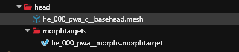<figcaption>
Before
</figcaption></figure>

<figure><figcaption>
After
</figcaption></figure>

You can use whichever naming convention makes sense for you, as long as you have two meshes with the same name and some way to differentiate between left and right.

Now, use WolvenKit's export tool and **export everything.**&#x20;

## Editing the meshes and morphtargets in Blender

Use the Blender I/O tool to import your meshes and morphtargets. You can do it one at a time or do both in the same project. It might be easier to do both because you can then toggle the right/left on or off to ensure you haven't fucked up and accidentally deleted the left when you were working on the right.

Here's what the left side looks like, I've hidden one of the files.

<figure>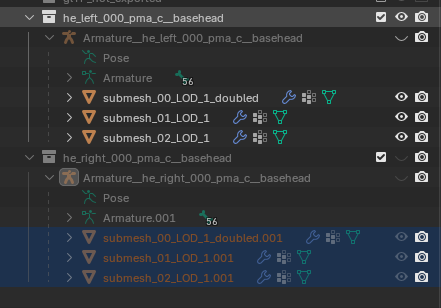<figcaption></figcaption></figure>

There are three submeshes: The eyelashes, the iris, and the rest of the eyeball. You could join and unjoin the meshes and there is a tool to do that on Nexus but idk how to do that so I'm going to do it the tedious way and manually select the sections for each submesh.


Materials are tied to submeshes. In order for the materials to work correctly, we need to maintain the submeshes as they are.


Switch into Edit Mode.

<figure>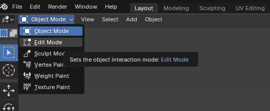<figcaption></figcaption></figure>

I'm starting with the first submesh, the vertices for the eyelashes on both will be selected when you switch into edit mode. You can click anywhere else in the viewport to deselect them.

<figure>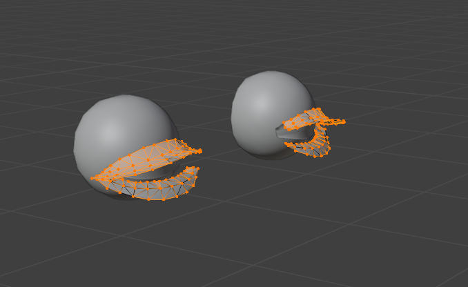<figcaption></figcaption></figure>


Left and right will be as if you were looking out from your V's eyes. You can move in the viewport so the eyelashes are opposite you if you need to orient yourself.


<figure>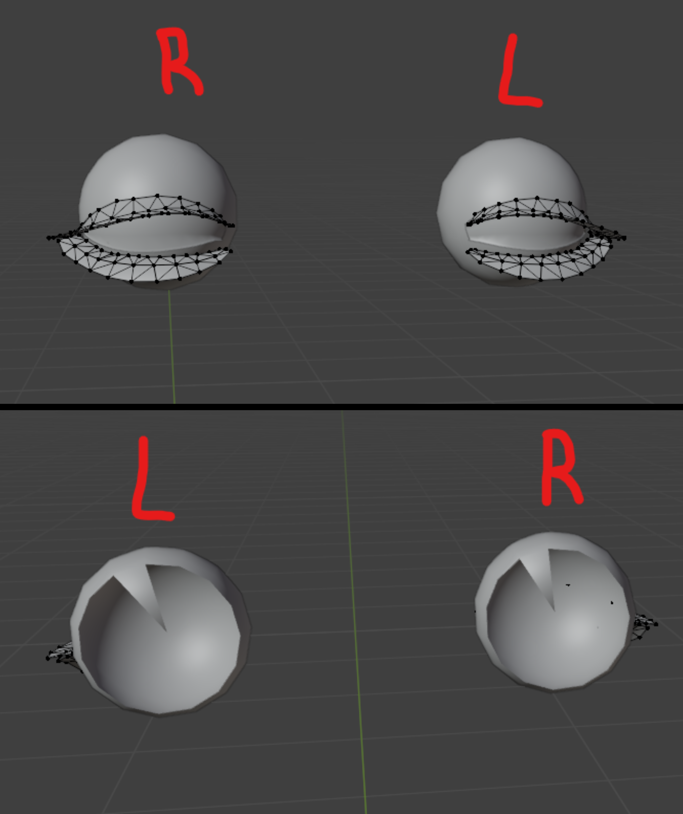<figcaption></figcaption></figure>

Since I'm working on the left eye mesh, I'm going to select all of the vertices of the right eye. You can drag a box over them or hold control or some other way to select them. I would use select linked as that will select all the vertices connected to another and since we want to delete this entire eyeball, that will work for us.


Mode

Edit Mode

Menu

Select ‣ Linked

Hotkey

<kbd>Ctrl-L</kbd>


Once you've select stuff, just hit delete on your keyboard and select "vertices". You may need to select things multiple times, idk Blender scares me.

This is what you should see now. No eyelash submesh on the eye we're deleting, eyelashes on the mesh we're keeping.

<figure>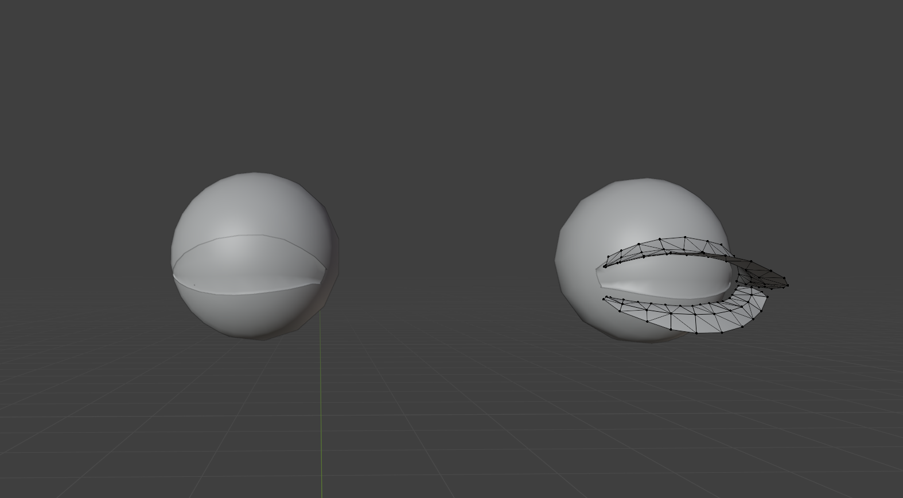<figcaption></figcaption></figure>

Switch back into object mode and select the next submesh.

<figure>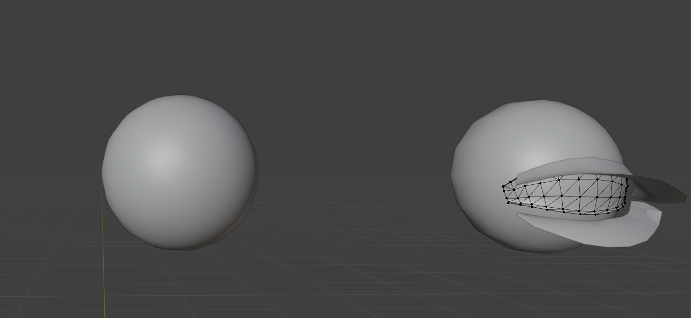<figcaption></figcaption></figure>

And now the rest of the eyeball.

Tada, we have one single left eye.

<figure>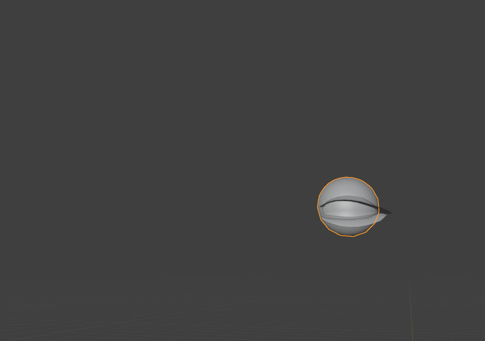<figcaption></figcaption></figure>

Back in object mode, select all the submeshes in the left pane for this eye and export to the matching glb.

<figure>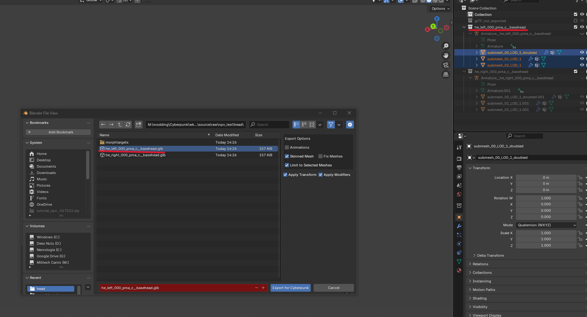<figcaption></figcaption></figure>

I would hide this and then do the right eye, that way you can toggle them both on when you're done and make sure you didn't delete the wrong shit.

With both meshes toggled on now, you should see both eyes.

<figure>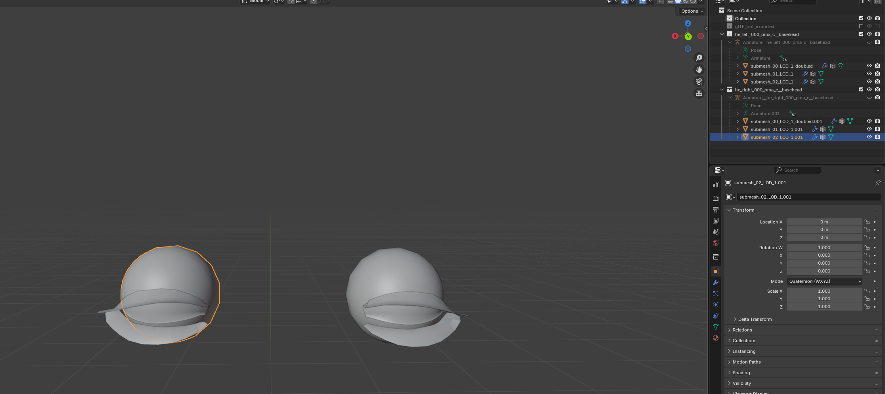<figcaption></figcaption></figure>

With both meshes exported from Blender, we can import them back into WolvenKit.

## Adding a second he\_ component to the app file

You can just duplicate the existing he\_ component and then rename stuff.

<figure>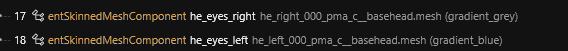<figcaption></figcaption></figure>

And that's it! You can then add the different diffuse textures for each eye to get heterochromia.
