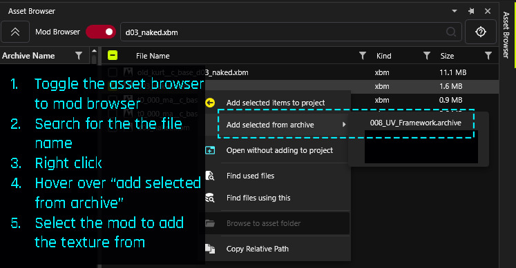
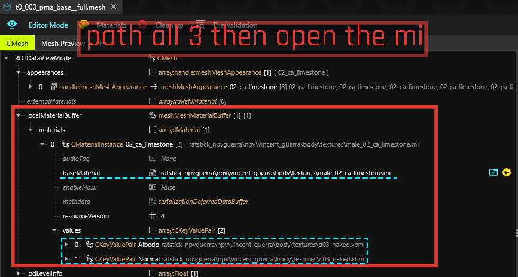
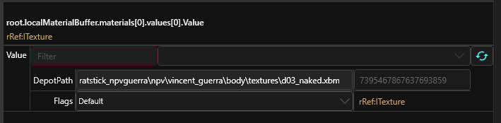
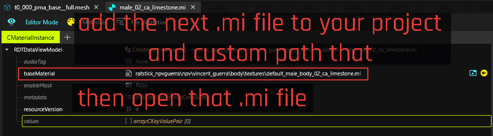
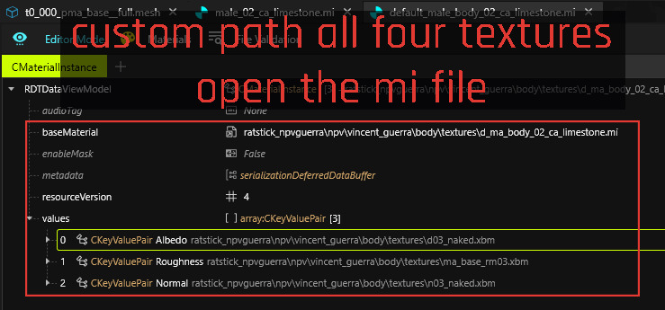
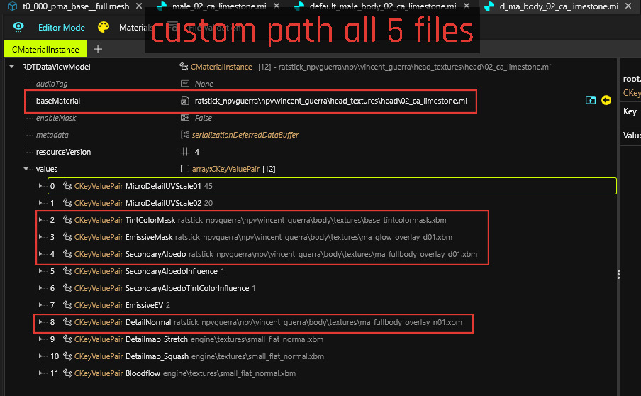
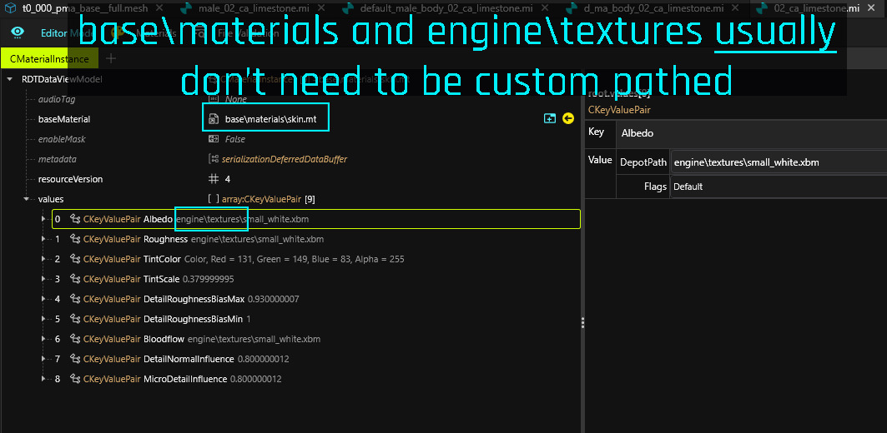

# Pathing skin textures


**custom pathing:** renaming a file or adding it to a different folder in your project to prevent any other game files (vanilla or modded) from overwriting your project and vice versa. I prefer custom folder structures because it helps me find files more easily.

**.mi file:** material instance. You can [read more about these on the wiki](https://wiki.redmodding.org/cyberpunk-2077-modding/for-mod-creators-theory/files-and-what-they-do/file-formats/materials/re-using-materials-.mi). All you need to know is that it is a type of texture file.

**.xbm file:** [from the wiki](https://wiki.redmodding.org/cyberpunk-2077-modding/for-mod-creators-theory/files-and-what-they-do/file-formats/materials/textures-.xbm-files): .dds files in a format REDEngine can use. Essentially, just images. When you export them, they usually get exported as PNGs for you to edit. The majority of modded skin textures are going to be .xbm files and what you want to pay particular attention to when custom pathing.

**localMaterialBuffer:** this tells the game what texture files to look for and use when loading an entity.

**DepotPath:** the file path to an asset (e.g. the xbm or mi file)

**relative path:** this is the path to an asset contained in the project.

(Let me know if more should be added here!)


### Pro tip: how to easily add a modded file to your project

The easiest way to quickly find and add the texture you need to your project is to search for the texture name in the asset browser. Then, you can right-click on the file and hover over "Add selected from archive." You should then see a list of mods that contain that file. Pay attention to the file size and if there are other files with the same name in the list of results in the asset browser.

Click on the mod and the file from that specific mod will be added to your project!

<figure><figcaption></figcaption></figure>

## Custom Pathing the Textures

For this, we're going to be looking at t0\_000\_pma\_base\_\_full.mesh from the NPV of my dear boy Vincent Guerra. I also use the UV framework for him, so we're using the mesh included in the UV framework.


**If you're using a tutorial file,** make sure you overwrite the vanilla body mesh with the modded one for the framework you're usin&#x67;**. Each framework's body will include additional file paths in their respective textures for the various overlays.**


### 1. In the mesh file

In my screenshot, I've cleaned up the appearances I don't need for this NPV. This is generally good practice to keep things neat and tidy.

VG uses 02\_ca\_limestone. Find the material entry in the **localMaterialBuffer** that matches the skin tone your NPV is using. You can use[ NoraLee's Parts Picker](https://noraleedoes.neocities.org/npv/npv_part_picker) if you're not sure what the name of the skin tone your V uses is.

<figure><figcaption></figcaption></figure>

You'll need to add the .mi file listed under baseMaterial and the d03\_naked.xbm and n03\_naked.xbm underneath "values" to your project. _**Make sure you rename the files or move the files to a different folder inside the project.**_ That's the whole point of custom pathing after all. (｡•̀ᴗ-)✧

Right-click on the file in your project explorer (on the left with all the files and folders for your project) and select "copy relative path to game file". That's what you'll paste on the right when you select the texture.

<figure><figcaption></figcaption></figure>

Once that's done, save the file and open up the .mi file you just added to your project.

### 2. The first .mi file

This one is simple, there's only one file we need to add and custom path.

<figure><figcaption></figcaption></figure>

Save, and open up the new .mi file you just added to your project.

### 3. The _second_ .mi file

This one has another .mi file and textures we'll need to add. It will include the same d03\_naked.xbm and n03\_naked.xbm. Since we already added those to our project in the first step, we can just recopy their respective relative paths and paste into the appropriate sections.

Add the roughness file to your project and path that. Remember, you can copy and paste the file name into the asset browser if you need to add it from a mod instead of the base game vanilla files.

<figure><figcaption></figcaption></figure>

Save and open the next .mi file.

### 4. The _third_ .mi file

This is where you'll usually find the spots to put your tattoo and other overlays.

<figure><figcaption></figcaption></figure>

Save, and you're done!

### The last .mi file

Generally, once you hit base\materials\file.exe or engine\textures, you don't need to custom path those. You may still want to add this .mi file to your project anyway, just in case the friend you're sending the NPV to has some kind of mod that overwrites it.

Personally, I take a very thorough approach and custom path as much as I can to ensure the NPV is a completely self-contained entity outside of base engine files.

<figure><figcaption></figcaption></figure>

### Final Thoughts

This process applies for custom pathing any mesh in your NPV. The body, complexion, hair, clothes. You're going to find the localMaterialBuffer and follow the texture paths.

Some general tips:

* Look into any .mi file to see if it has additional items that may need to be custom pathed.
* Don't forget to check the "values" section in the cMaterialInstance. If something looks off with textures, you likely just forgot to check there and path them appropriately.
* When in doubt, just redo the pathing. Right click > copy relative path > paste.

And remember, NPVs are essentially Mr. Potato Head dolls. The .app file is the body, and all the components are the features and clothing you can slap on the doll. Wanna add two different types of face cyberware? Just add 'em!

My DMs are always open if you need help with your NPV. You can also find me in the main modding discord under ratstick.
