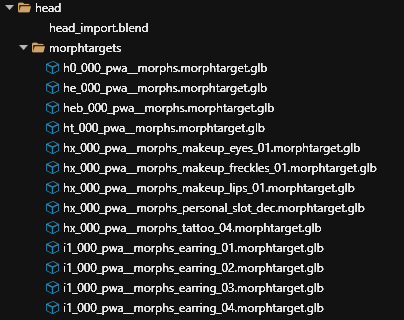

# Using the head.blend script (WIP)


The Blender I/O tool has been updated. Make sure you have the most up to date version if you encounter an issue when exporting. [You can find the lates version here.](https://github.com/WolvenKit/Cyberpunk-Blender-add-on/releases)


### Mesh/morphtarget clean up

The tutorial file contains meshes and mrophtargets for multiple CC options. In the head folder, remove any meshes or morphtargets that your character doesn’t use. You can use the output from NoraLee’s parts picker as a guide.

Additionally, you’ll want to add meshes and morphtargets for any modded items that your OC uses on the face. Alternatively, you can do this later and rebuild the head.

### Export the morphtargets

Follow [this part of the guide in the main wiki](https://wiki.redmodding.org/cyberpunk-2077-modding/modding-guides/npcs/npv-v-as-custom-npc/npv-preparing-the-head-in-blender#step-2-exporting-head) for instructions on the files you need to export. We only need to export the morphtargets.

If you scroll down in the project explorer, you should now see the glb files in the raw folder.

### Using the Blender script

Find the head.blend file in your project and open it.

This is what you should see in Blender:

The script will handle all the shapekeying for you. First, the script will import the files. Click the little play button at the top to the right of where you see “00\_import\_files.py”

.png>)

This will take a second.

Once the import is complete, you should see the default head in the pane on the left. 

.png>)

Next, click the little icon that looks like a piece of paper to the right of the script name.

.png>) 

Select 01\_apply\_shapekeys.py

Remember how I had you write down the CC values? This is where those come in handy. Enter the appropriate values for the eyes, nose, mouth, jaw, and ears.

.png>)

Here is a screenshot of mine so you can see what it looks like with the numbers changed.

.png>) 

Once this is filled out, you’ll click the play button again.

.png>)

You’ll know it’s done when the head looks different.

Click the little paper icon again to move to the next script 02\_export\_files.py and click the play button.

.png>)

You’ll know this is done when one of the meshes or submesh components is highlighted in orange. This exports the changed files back into the raw folder so we can import.

.png>)

You can close Blender now. If it asks if you want to save, I’d click no. I do that because I don’t want any hiccups in the process.

### Import the files

You can just click “import all” this time. 

.png>) 

And now you have files updated to match your OC’s face!

At this point, I recommend custom pathing the head meshes inside the .app file because there can be this weird drift that can happen where your head will look slightly different each time you load.

Once you do that, go ahead and test to make sure it looks right. Don’t worry about the textures or mesh appearances just yet (unless you want to change those now), we just want to make sure the shape looks right.
